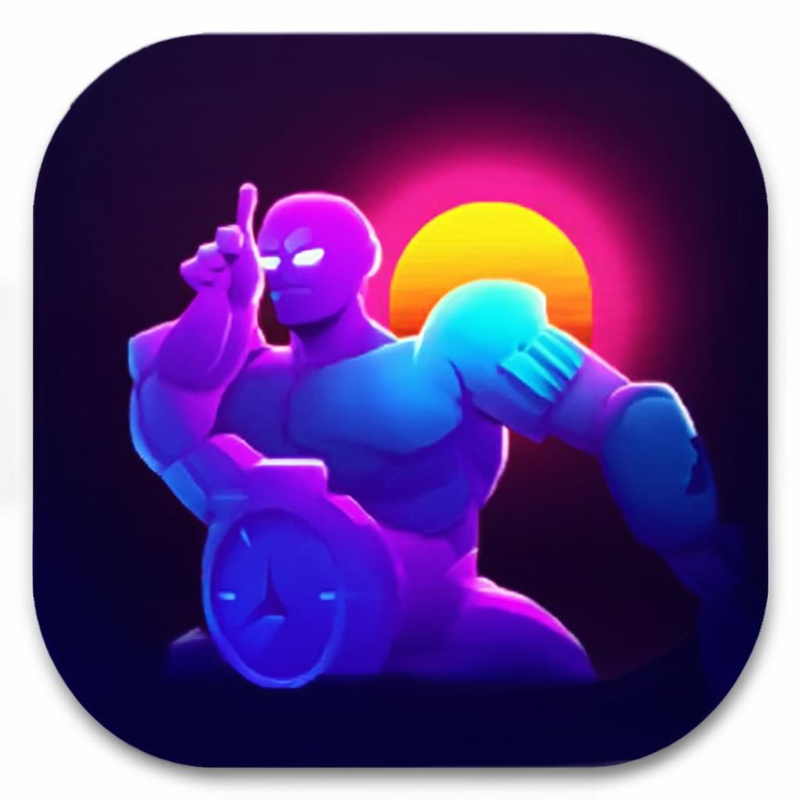

# WakeUp Warrior - Android Alarm App

<p align="center">
  
</p>

## 📱 About

WakeUp Warrior is a revolutionary alarm clock app that **doesn't stop until you complete a challenge**. Say goodbye to oversleeping and hello to productive mornings!

### 🎯 Key Features

- **Multiple Challenge Types**: Math puzzles, Memory games, QR code scanning, Shake challenges, Typing tests, Voice commands, and Step counting
- **Smart Escalation**: Alarm gets louder over time if you don't respond
- **Gamification**: Daily streaks, achievements, and coin rewards
- **Glassmorphic UI**: Beautiful, modern dark theme with glass effects
- **Reliable Alarms**: Works even when app is killed or phone is in Doze mode
- **Premium Features**: Unlimited alarms, all challenge types, custom sounds, and more

## 🛠 Tech Stack

| Category | Technology |
|----------|------------|
| Language | Kotlin |
| UI Framework | Jetpack Compose |
| Architecture | MVVM + Clean Architecture |
| Dependency Injection | Hilt |
| Local Database | Room |
| Preferences | DataStore |
| Navigation | Compose Navigation |
| Animations | Lottie |
| Camera | CameraX |
| ML Kit | Barcode Scanning |
| Ads | AdMob |
| Billing | Google Play Billing |
| Background Work | WorkManager |

## 📁 Project Structure

```
app/src/main/java/com/wakeupwarrior/
├── core/                    # Core utilities
│   ├── di/                  # Dependency Injection
│   ├── util/                # Extensions, Constants
│   ├── alarm/               # Alarm scheduling
│   └── notification/        # Notifications
├── data/                    # Data layer
│   ├── local/               # Room database, DAOs
│   ├── repository/          # Repository implementations
│   └── model/               # Data models
├── domain/                  # Domain layer
│   ├── model/               # Domain models
│   ├── repository/          # Repository interfaces
│   └── usecase/             # Business logic
├── presentation/            # UI layer
│   ├── theme/               # Colors, Typography, Shapes
│   ├── components/          # Reusable composables
│   ├── navigation/          # Navigation graph
│   └── screens/             # Screen composables + ViewModels
└── service/                 # Background services
```

## 🚀 Getting Started

### Prerequisites

- Android Studio Hedgehog (2023.1.1) or later
- JDK 17
- Android SDK 34
- Kotlin 1.9.22+

### Setup

1. **Clone the repository**
   ```bash
   git clone https://github.com/yourusername/wakeup-warrior.git
   cd wakeup-warrior
   ```

2. **Open in Android Studio**
   - Open Android Studio
   - Select "Open an existing project"
   - Navigate to the project directory

3. **Sync Gradle**
   - Click "Sync Now" when prompted
   - Wait for all dependencies to download

4. **Run the app**
   - Connect an Android device or start an emulator
   - Click Run (green play button)

### Building for Production

```bash
# Debug APK
./gradlew assembleDebug

# Release APK
./gradlew assembleRelease

# Release Bundle (for Play Store)
./gradlew bundleRelease
```

## ☁️ Building with Bitrise

This project is configured for cloud builds on [Bitrise](https://bitrise.io):

### Quick Setup

1. **Connect your repository**
   - Log in to Bitrise
   - Click "Add New App"
   - Select your Git provider and repository

2. **Configure the app**
   - Platform: Android
   - Bitrise will auto-detect the `bitrise.yml` configuration

3. **Set up secrets** (for release builds)
   - Copy `bitrise.secrets.yml.example` to `bitrise.secrets.yml`
   - Add your signing keystore and Google Play credentials in Bitrise dashboard:
     - `BITRISEIO_ANDROID_KEYSTORE_URL` - Upload your keystore
     - `BITRISEIO_ANDROID_KEYSTORE_PASSWORD` - Keystore password
     - `BITRISEIO_ANDROID_KEYSTORE_ALIAS` - Key alias
     - `BITRISEIO_ANDROID_KEYSTORE_PRIVATE_KEY_PASSWORD` - Key password
     - `BITRISEIO_SERVICE_ACCOUNT_JSON_KEY_URL` - Google Play service account

4. **Start building!**

### Workflows

| Workflow | Trigger | Output |
|----------|---------|--------|
| `debug` | PRs, push to develop | Debug APK |
| `primary` | Push to main | Debug APK + Tests |
| `release` | Git tag (v*) | Signed Release APK/AAB |

### Local Bitrise Testing

```bash
# Install Bitrise CLI
brew install bitrise

# Run debug workflow locally
bitrise run debug

# Validate bitrise.yml
bitrise validate
```

## 🔑 Configuration

### AdMob (Test IDs are pre-configured)

Replace with your real AdMob IDs in production:
```kotlin
// In Constants.kt
object AdMob {
    const val BANNER_AD_UNIT_ID = "ca-app-pub-xxxxx/xxxxx"
    const val INTERSTITIAL_AD_UNIT_ID = "ca-app-pub-xxxxx/xxxxx"
}
```

### Signing Configuration

For release builds, you need:
- A keystore file
- Keystore password, key alias, and key password
- Configure these in Bitrise secrets or `local.properties`

## 📱 Screenshots

*Screenshots will be added after initial release*

## 🏗 Architecture

The app follows Clean Architecture with MVVM pattern:

```
┌─────────────────────────────────────────────────────────┐
│                    Presentation Layer                    │
│  (Compose UI, ViewModels, Navigation, Theme)            │
├─────────────────────────────────────────────────────────┤
│                     Domain Layer                         │
│  (Use Cases, Repository Interfaces, Domain Models)      │
├─────────────────────────────────────────────────────────┤
│                      Data Layer                          │
│  (Room Database, Repository Implementations, APIs)      │
└─────────────────────────────────────────────────────────┘
```

## 💰 Monetization

- **Free Tier**: 3 alarms, basic challenges (Math, Shake), ads
- **Premium Tier**: $2.99/month or $19.99/year
  - Unlimited alarms
  - All challenge types
  - Custom sounds
  - No ads
  - Premium themes
- **Lifetime**: $49.99 one-time

## 🤝 Contributing

Contributions are welcome! Please read our contributing guidelines before submitting PRs.

1. Fork the repository
2. Create your feature branch (`git checkout -b feature/AmazingFeature`)
3. Commit your changes (`git commit -m 'Add some AmazingFeature'`)
4. Push to the branch (`git push origin feature/AmazingFeature`)
5. Open a Pull Request

## 📄 License

This project is licensed under the MIT License - see the [LICENSE](LICENSE) file for details.

## 📞 Contact

For questions or support, please open an issue on GitHub.

---

**WakeUp Warrior** - Rise. Conquer. Repeat. ⏰
